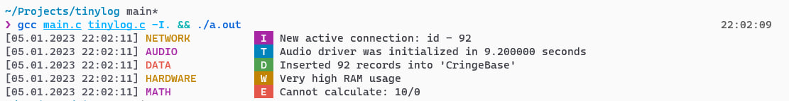

#  **tinylog** - stupid-easy logging

 
 


A simple, slightly customizable library for colored logging in C which was inspired
by the new logcat UI in the Android Studio

## Example

```c
// Include the librarie's header
#include <tinylog.h>

...

// Need for setting up some global variables 
tiny_log_init();

// Make some records
tiny_log("NETWORK" , levelInfo   , "New active connection: id - %d", 92);
tiny_log("AUDIO"   , levelTrace  , "Audio driver was initialized in %f seconds", 9.2);
tiny_log("DATA"    , levelDebug  , "Inserted %d records into '%s'", 92, "CringeBase");
tiny_log("HARDWARE", levelWarning, "Very high RAM usage");
tiny_log("MATH"    , levelError  , "Cannot calculate: %d%c%d", 10, '/', 0);

// Free allocated memory
tiny_log_destroy();
```



### Custom output stream

By default all logs are written to stdout, but it can be changed

```c
// Move output to stderr
tiny_log_set_out(stderr, false);

// Or to file 'test.log'
tiny_log_set_out(fopen("test.log", "w"), true);
```

The second argument of the `tiny_log_set_out` need for calling fclose method
with given stream on destroy state (or not).

## Post Scriptum

There is no any errors handling and you also cannot disable coloring, but the library
is tiny so use it as it is

Have a nice day, by KonstantIMP

